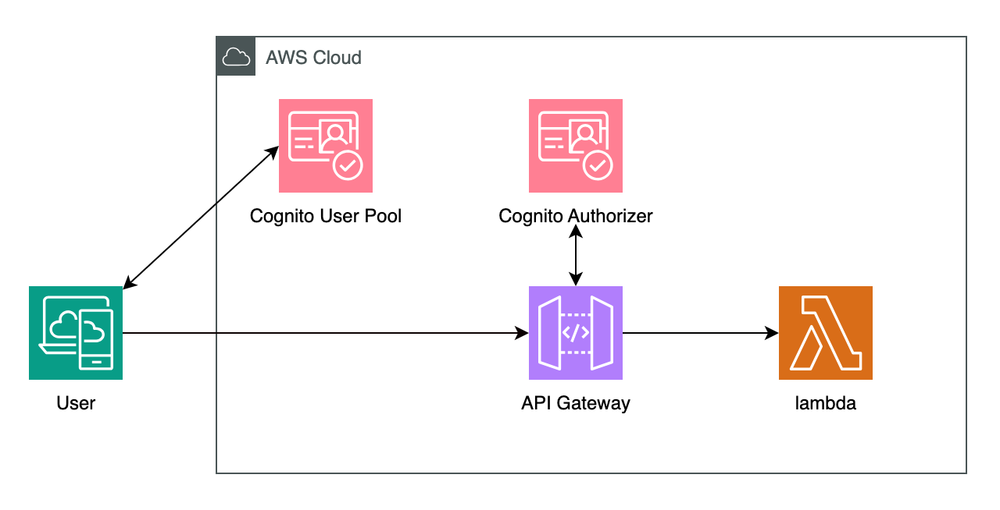

# Cognito 認証基盤構築

<p align="center">
  
</p>


[](https://www.python.org/)


## 概要
このリポジトリには、AWS Cognitoを使用した認証基盤をTerraformで構築するためのコードが含まれています。API Gatewayと連携したサーバーレス認証システムで、バックエンドにLambda関数を使用しています。

## アーキテクチャ
システムは以下のコンポーネントで構成されています：

+ AWS Cognito: ユーザー認証と認可を管理
+ API Gateway: RESTful APIエンドポイントの提供とCognitoトークンの検証
+ Lambda: バックエンドロジックの実行


## インフラの構築と実行

### 1. 以下のコードを実行してインフラを構築します。
```
bin/terraform_apply
```

### 2. ユーザー認証の開始

まず、admin-initiate-auth コマンドを使って、ユーザーの認証を開始します。この段階では、ユーザー名と一時的なパスワードを使用します。

```
aws cognito-idp admin-initiate-auth \
  --user-pool-id <USER_POOL_ID> \
  --client-id <CLIENT_ID> \
  --auth-flow ADMIN_NO_SRP_AUTH \
  --auth-parameters USERNAME=testuser@example.com,PASSWORD=TempPass123!
```

このコマンドが成功すると、Cognitoはチャレンジを返す場合があります（例えば、NEW_PASSWORD_REQUIRED）。

### 3. パスワード変更の応答 (admin-respond-to-auth-challenge)

次に、ユーザーが初回ログイン時にパスワードを変更する必要がある場合（NEW_PASSWORD_REQUIRED）、admin-respond-to-auth-challenge コマンドで新しいパスワードを設定します。

```
aws cognito-idp admin-respond-to-auth-challenge \
  --user-pool-id <USER_POOL_ID> \
  --client-id <CLIENT_ID> \
  --challenge-name NEW_PASSWORD_REQUIRED \
  --challenge-responses USERNAME=testuser@example.com,NEW_PASSWORD=NewSecurePass123! \
  --session <YOUR_SESSION_TOKEN>
```

ここで、<YOUR_SESSION_TOKEN> は前のステップで取得したセッショントークンです。

### 4. アクセストークンの取得

認証が完了すると、レスポンスとしてアクセストークン（access_token）、IDトークン（id_token）、リフレッシュトークン（refresh_token）が返されます。

```
{
  "access_token": "eyJraWQiOi...",
  "id_token": "eyJraWQiOi...",
  "refresh_token": "eyJjdHkiOi...",
  "expires_in": 3600,
  "token_type": "Bearer"
}
```

+ access_token: APIリクエストに使う
+ id_token: ユーザー情報を取得するために使う（アプリケーション内部で）
+ refresh_token: アクセストークンの再取得に使う

### 5. APIへのリクエスト（認証）

次に、取得したアクセストークンを使って保護されたAPIにアクセスします。

```
curl -X GET https://<YOUR_API_ID>.execute-api.ap-northeast-1.amazonaws.com/hello \
  -H "Authorization: Bearer <YOUR_ACCESS_TOKEN>"
```

#### 6. レスポンス例

以下のメッセージが表示されます。

```
Hello from a protected API!
```

### 停止
以下のコードを実行すると停止できます。
```
bin/terraform_destroy
```
